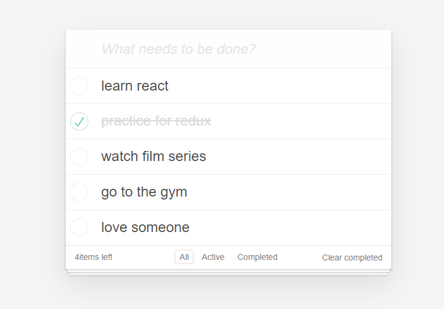

# TODO APP

This project was build with React.

## What Does It Provide

You can easily add, delete, update, filter and list todos.

## Available Scripts

If you run project, you have to write below command:

### `npm start`

And then open
[http://localhost:3000](http://localhost:3000) to view it in your browser.

The page will reload when you make changes.
